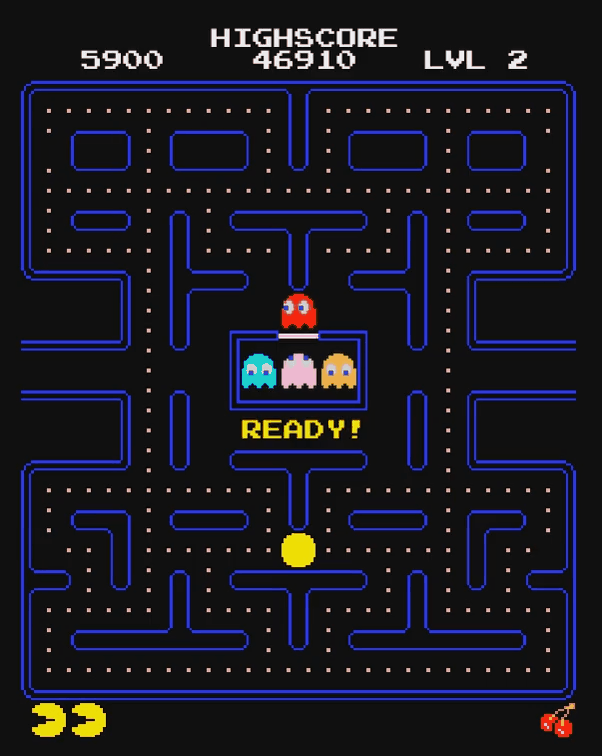

# Pac-Man

Classic Pac-Man recreated in C++ using Qt Widgets. The project was developed as a portfolio project focused on object-oriented programming, Qt graphics framework, and cross-platform deployment.

**Live Demo:** https://pac-man-eosin-xi.vercel.app/



## Features

* Classic Pac-Man gameplay with player movement, ghost AI, scoring, lives, and level progression.
* Object-oriented architecture with inheritance-based entity design.
* Different ghost behaviors inspired by the original game:

  * Blinky - direct chase behavior.
  * Pinky - predictive targeting.
  * Inky - target calculation based on player and Blinky positions.
  * Clyde - distance-based chase/scatter behavior.
* Animated sprites, collectibles, power pellets, fruit bonuses, and game states.
* Persistent high score:

  * `highscore.txt` on desktop.
  * Browser `localStorage` in WebAssembly build.
* Desktop and browser versions built from the same C++ codebase.

## Technical Highlights

### Object-Oriented Design

The project uses object-oriented principles to model game entities and their relationships.

Main inheritance structure:

```
Entity
├── Player
└── Ghost
    ├── Blinky
    ├── Pinky
    ├── Inky
    └── Clyde
```

The `Entity` class provides common movement and grid-related functionality. `Ghost` defines shared ghost behavior, while individual ghost classes override target selection logic.

Polymorphism is used through the ghost behavior interface, allowing different ghost algorithms to be handled through a common abstraction.

Encapsulation is applied by keeping object-specific logic, timers, animations, and state management inside dedicated classes.

## Qt Architecture

The game uses Qt's Graphics View Framework:

* `QGraphicsScene` manages game worlds and objects.
* `QGraphicsView` displays scenes.
* `QGraphicsPixmapItem` handles sprite rendering.
* `QGraphicsTextItem` is used for HUD elements.
* `QTimer` drives movement, animations, and game events.
* Signals and slots are used for communication between game components.

The project also uses Qt Resource System (`.qrc`) to bundle images, fonts, and other assets.

## Memory Management

The project uses Qt's object ownership system together with explicit lifetime management.

* `QObject`-based objects use Qt parent-child ownership.
* Dynamically created scene objects are managed by game classes and removed when no longer needed.
* The project intentionally does not use smart pointers, relying instead on Qt's ownership model and controlled object lifetimes.

## WebAssembly Deployment

The game can be compiled both as a native desktop application and as a browser application.

The web version uses:

* Qt WebAssembly
* Emscripten
* WebAssembly target

Because Qt Multimedia is not available in the WebAssembly build, audio playback was implemented with a browser-compatible JavaScript audio layer while keeping the same C++ interface through `SoundManager`.

## Technologies

| Area           | Technology                          |
| -------------- | ----------------------------------- |
| Language       | C++                                 |
| Framework      | Qt Widgets                          |
| Graphics       | Qt Graphics View Framework          |
| Build System   | qmake                               |
| Desktop Audio  | Qt Multimedia (`QSoundEffect`)      |
| Web Audio      | JavaScript Audio API via Emscripten |
| Web Deployment | Qt WebAssembly + WebAssembly        |
| Hosting        | Vercel                              |
